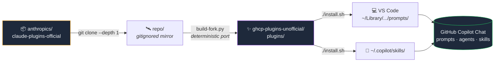
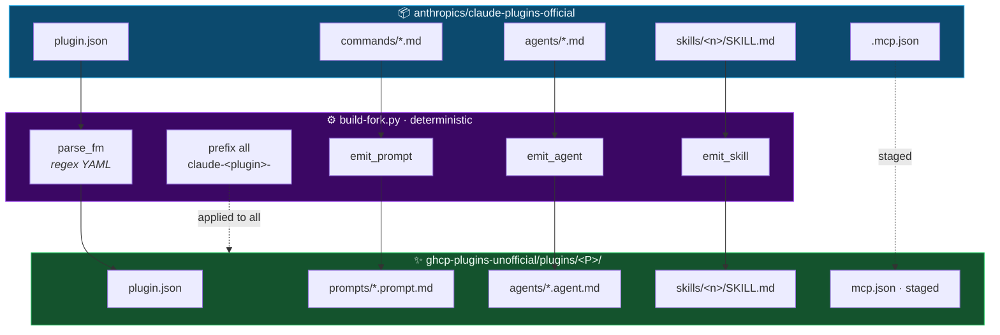

<div align="center">

<br/>


<br/>

### _A constellation of Claude Code plugins, reborn for GitHub Copilot Chat in VS Code._

[](LICENSE)
[](https://www.apache.org/licenses/LICENSE-2.0)
[](#-the-pantheon)
[](#-the-pantheon)
[](https://code.visualstudio.com/)
[](https://github.com/anthropics/claude-plugins-official)

<p>
  <em>One repo. One <code>./install.sh</code>. Twenty-one specialist agents in your sidebar.</em><br/>
  <sub>Not affiliated with Anthropic or GitHub. Upstream content © Anthropic & contributors (Apache 2.0).</sub>
</p>

<a href="#-quick-start"></a>
<a href="#-the-pantheon"></a>
<a href="docs/INSTALL.md"></a>
<a href="#-architecture"></a>

</div>

---

## 🌌 Why this exists

[Claude Code plugins](https://code.claude.com/docs/en/plugins) bundle **slash commands · sub-agents · skills · MCP servers · hooks** into a single installable package. GitHub Copilot Chat in VS Code has the same building blocks — **prompts, agents, skills, MCP** — but speaks a *different on-disk dialect* and YAML frontmatter. So a Claude plugin can't drop in verbatim.

This repo is the **Rosetta stone** between the two ecosystems:



> [!TIP]
> Install once, reload VS Code, and 21 specialist personas live in your `/` slash menu and `@` agent picker. Each is renamed `claude-<plugin>-…` so they never collide with your own customizations.

---

## ⚡ Quick start

```bash
git clone https://github.com/saadmsft/ghcp-plugins-unofficial.git
cd ghcp-plugins-unofficial

./install.sh --list                     # 👀 see the roster
./install.sh --dry-run code-review      # 🔍 preview a single install
./install.sh code-review feature-dev    # 🎯 install two
./install.sh                            # 🌊 install ALL 21
```

Then in VS Code:

| | |
|---|---|
| ⌨️ | <kbd>⌘</kbd>+<kbd>⇧</kbd>+<kbd>P</kbd> → **Developer: Reload Window** |
| `/` | Type a slash in Copilot Chat — `/claude-…` prompts appear |
| `@` | Mention an agent — `@Claude: feature-dev — code-architect` |
| 🧠 | Ask anything — skills auto-trigger by description |

> [!NOTE]
> Need a step-by-step? → **[docs/INSTALL.md](docs/INSTALL.md)** has macOS / Linux / Windows recipes, verification commands, and an MCP-merge walkthrough.

---

## 🗺️ What lands where

```
┌─────────────────────────────────────────────────────────────────────────┐
│  plugins/<P>/prompts/*.prompt.md   →   ~/Library/.../Code/User/prompts/ │  →  /claude-<P>-<cmd>
│  plugins/<P>/agents/*.agent.md     →   ~/Library/.../Code/User/prompts/ │  →  @Claude: <P> — <agent>
│  plugins/<P>/skills/<S>/...        →   ~/.copilot/skills/<S>/           │  →  auto-trigger by description
│  plugins/<P>/mcp.json              →   ⛔ manual merge (your call)      │  →  MCP tools in Copilot
└─────────────────────────────────────────────────────────────────────────┘
```

🍎 macOS path shown. Linux/WSL substitutes `${XDG_CONFIG_HOME:-$HOME/.config}/Code/User/`. Windows is documented in **[docs/INSTALL.md](docs/INSTALL.md#windows)**.

---

## 🎭 The Pantheon

> **21 plugins · 26 prompts · 21 agents · 22 skills · 1 MCP placeholder**

Each row is one plugin — its emoji is its calling card, its **codename** is your shortcut to remembering what it does, and the counts show what landed in your VS Code profile after `./install.sh`.

| | Plugin | Codename | 💬 | 🤖 | 🧠 | 🔌 | Purpose |
|---|---|---|---:|---:|---:|:---:|---|
| 🛠️ | [`agent-sdk-dev`](plugins/agent-sdk-dev/) | **Hephaestus** | 1 | 2 | – | – | Verifies Anthropic Agent SDK apps (TS + Python) |
| 🚀 | [`claude-code-setup`](plugins/claude-code-setup/) | **Genesis** | – | – | 1 | – | Onboarding skill — Claude Code first principles |
| 📝 | [`claude-md-management`](plugins/claude-md-management/) | **Scribe** | 1 | – | 1 | – | Manage `CLAUDE.md` / `AGENTS.md` / `copilot-instructions.md` |
| 🏛️ | [`code-modernization`](plugins/code-modernization/) | **Argonauts** | 7 | 5 | – | – | Legacy → modern pipeline: analyst · test-engineer · architecture-critic · security-auditor · business-rules-extractor |
| 🔍 | [`code-review`](plugins/code-review/) | **The Tribunal** | 1 | – | – | – | Multi-agent PR review with confidence scoring |
| ✂️ | [`code-simplifier`](plugins/code-simplifier/) | **Occam** | – | 1 | – | – | Refactor for clarity — preserves behavior |
| 🌿 | [`commit-commands`](plugins/commit-commands/) | **Hermes** | 3 | – | – | – | Conventional commits, autocommit, PR helpers |
| 🛠️ | [`cwc-makers`](plugins/cwc-makers/) | **The Makers** | 1 | – | 2 | – | "Code with Claude" maker workflows |
| 🎒 | [`example-plugin`](plugins/example-plugin/) | **Hello-World** | 1 | – | 2 | ✓ | Reference plugin (MCP is placeholder) |
| 🌱 | [`feature-dev`](plugins/feature-dev/) | **The Trinity** | 1 | 3 | – | – | spec → code-explorer → code-architect → code-reviewer loop |
| 🎨 | [`frontend-design`](plugins/frontend-design/) | **Aesthete** | – | – | 1 | – | Design-system / UI conventions skill |
| 🪝 | [`hookify`](plugins/hookify/) | **The Watcher** | 4 | 1 | 1 | – | Conversation-analyzer + helpers _(hooks themselves not ported)_ |
| ➗ | [`math-olympiad`](plugins/math-olympiad/) | **Euclid** | – | – | 1 | – | Competition-math problem-solving |
| 🔌 | [`mcp-server-dev`](plugins/mcp-server-dev/) | **The Forge** | – | – | 3 | – | Build · test · host MCP servers |
| 🌉 | [`mcp-tunnels`](plugins/mcp-tunnels/) | **Iris** | 1 | – | – | – | Expose local MCP servers via tunnels |
| 🎪 | [`playground`](plugins/playground/) | **Sandbox** | – | – | 1 | – | Scratch / experimentation skill |
| 🧩 | [`plugin-dev`](plugins/plugin-dev/) | **Daedalus** | 1 | 3 | 7 | – | Author plugins: skill-reviewer · plugin-validator · agent-creator |
| 🦅 | [`pr-review-toolkit`](plugins/pr-review-toolkit/) | **The Six** | 1 | 6 | – | – | Six specialist reviewers: silent-failure-hunter · type-design-analyzer · comment-analyzer · pr-test-analyzer · code-reviewer · code-simplifier |
| 🔁 | [`ralph-loop`](plugins/ralph-loop/) | **Sisyphus** | 3 | – | – | – | "Run until done" iteration pattern |
| 📒 | [`session-report`](plugins/session-report/) | **Chronicle** | – | – | 1 | – | Generate session / standup reports |
| 🧪 | [`skill-creator`](plugins/skill-creator/) | **Athena** | – | – | 1 | – | Iteratively author + evaluate skills (485-line meta-skill) |

<details>
<summary>👻 <b>Plugins intentionally NOT ported</b> (and why) — click to expand</summary>

| Category | Count | Plugins | Why skipped |
|---|---:|---|---|
| **LSP wrappers** | 12 | `clangd-lsp`, `csharp-lsp`, `gopls-lsp`, `jdtls-lsp`, `kotlin-lsp`, `lua-lsp`, `php-lsp`, `pyright-lsp`, `ruby-lsp`, `rust-analyzer-lsp`, `swift-lsp`, `typescript-lsp` | VS Code already has first-class LSP integrations. The Claude-side plugin only exists to wire LSPs into Claude Code's edit-event loop. |
| **Hook / output-style only** | 3 | `explanatory-output-style`, `learning-output-style`, `security-guidance` | GHCP has no analog for Claude Code `hooks/` (shell scripts on `PostToolUse`, `UserPromptSubmit`) or output-style customization. |
| **Placeholders** | 1 | `example-plugin`'s `.mcp.json` → `https://mcp.example.com/api` | Staged but not auto-merged into your MCP config. |

Full reasoning: **[docs/MAPPING.md › what-cannot-be-ported](docs/MAPPING.md#what-cannot-be-ported)**

</details>

---

## 🧭 Repo layout

```
ghcp-plugins-unofficial/
│
├── 🚀  install.sh                  # the one button you came for
├── 🧹  uninstall.sh                # reverse it surgically
├── 🔄  sync-from-upstream.sh       # re-port from a fresh upstream clone
├── 🗂️  marketplace.json            # machine-readable index of all 21
│
├── 📦  plugins/                    # 21 ported plugins, one folder each
│   └── <plugin-name>/
│       ├── plugin.json             # metadata + inventory
│       ├── prompts/                # *.prompt.md  ── slash commands
│       ├── agents/                 # *.agent.md   ── chat participants
│       ├── skills/<name>/          # SKILL.md + bundled resources
│       ├── mcp.json                # MCP server defs (if applicable)
│       ├── README.md               # per-plugin docs + install snippet
│       └── LICENSE                 # Apache 2.0, preserved from upstream
│
├── 📚  docs/
│   ├── GHCP-PRIMER.md              # 🆕 New to Copilot customization? Start here.
│   ├── MAPPING.md                  # 🔀 Claude → GHCP feature translation
│   ├── INSTALL.md                  # 💿 Detailed install / verify / per-OS
│   ├── TROUBLESHOOTING.md          # 🩺 Symptom → cause → fix
│   ├── ARCHITECTURE.md             # 🏛️ How build-fork.py works
│   └── PORTING.md                  # 🛠️ Add a plugin · customize porter
│
├── README.md                       # ← you are here
├── LICENSE                         # MIT for tooling
├── CHANGELOG.md
└── CONTRIBUTING.md
```

> [!IMPORTANT]
> The porter (`build-fork.py`) lives **one directory up** at `../build-fork.py` — the fork's working tree stays clean of build tooling. Architectural rationale: **[docs/ARCHITECTURE.md](docs/ARCHITECTURE.md)**.

---

## 🎛️ Install / uninstall reference

```bash
./install.sh                              # 🌊 install ALL plugins
./install.sh code-review                  # 🎯 install one
./install.sh code-review feature-dev      # 🎯 install several
./install.sh --list                       # 📜 print plugin names, one per line
./install.sh --dry-run                    # 👀 show what would be copied (no writes)
./install.sh --dry-run code-modernization # 👀 combine with selection
./install.sh -h                           # ❓ built-in help

./uninstall.sh                            # 🧹 remove ALL claude-* from your profile
./uninstall.sh hookify                    # 🧹 remove just one
```

> [!CAUTION]
> **Skills are removed-then-copied, not merged.** Any local edits inside `~/.copilot/skills/claude-…/` will be lost on re-install. Make changes in `plugins/<P>/skills/…` and re-run `./install.sh` instead.

> [!WARNING]
> **MCP servers are never auto-merged** into your user `mcp.json`. The porter stages them per-plugin so you can review and merge intentionally — see **[docs/INSTALL.md › MCP servers](docs/INSTALL.md#mcp-servers)**.

---

## 🔄 Staying in sync with upstream

```bash
./sync-from-upstream.sh    # 1️⃣ pulls latest anthropics/claude-plugins-official
                           # 2️⃣ regenerates plugins/ deterministically
                           # 3️⃣ leaves your tree dirty for review
git diff                   # 4️⃣ inspect what changed
git commit -am "sync: $(date -u +%Y-%m-%d)"
```

The porter is **byte-deterministic** — running it twice on the same upstream commit produces identical output. `git diff` is a clean signal of what changed upstream this cycle. Details: **[docs/PORTING.md › Syncing](docs/PORTING.md#syncing)**.

---

## 🏛️ Architecture



**Seven invariants** the porter must preserve (full list in **[docs/ARCHITECTURE.md](docs/ARCHITECTURE.md)**):

1. 🔒 **Idempotent** — running twice on same input = identical output
2. 🪶 **Lossless naming** — every artifact prefixed `claude-<plugin>-`, never collides
3. 📜 **Apache-preserving** — per-plugin `LICENSE` always copied verbatim
4. ⚪ **No-PyYAML** — regex-only frontmatter parser, zero runtime dependencies
5. 🛡️ **No mutation of installed files** — `install.sh` only copies, never edits
6. 🚫 **No silent MCP merge** — user opts in manually for every server
7. 🎯 **Skippable explicitly** — LSP/hook-only plugins are filtered with reasons logged

---

## ⚠️ Caveats

> [!WARNING]
> 1. **🔧 Tool references don't translate.** Claude's `allowed-tools: Bash(gh pr view:*), Read, Grep` is stripped — GHCP's tool surface uses different names. Prompts that say "use a Haiku agent" or "spawn a sub-agent with the Task tool" become *guidance*, not literal sub-spawns. Prose-style prompts still work well.
> 2. **🪝 Hooks are dropped.** No GHCP analog for `hooks/` shell scripts.
> 3. **🎨 Output styles are dropped.** Same reason.
> 4. **🔌 MCP servers are staged, not auto-installed.** Manual merge gives you a chance to review.
> 5. **🧠 Skill triggers depend on description quality.** GHCP loads skills lazily by description match. A ported skill that never triggers usually needs description tuning — see **[TROUBLESHOOTING](docs/TROUBLESHOOTING.md#skill-never-auto-triggers)**.
> 6. **🏷️ The `claude-` prefix is hygiene, not branding.** It guarantees no collision and reliable uninstall — at the cost of mouthful slash-commands like `/claude-pr-review-toolkit-review-pr`. VS Code's incremental filter helps.

---

## 📚 More docs

| 📄 Doc | 🎯 When to read it |
|---|---|
| [`docs/GHCP-PRIMER.md`](docs/GHCP-PRIMER.md)         | New to GHCP customization? Start here. |
| [`docs/MAPPING.md`](docs/MAPPING.md)                 | "What exactly does the porter do to a command vs an agent vs a skill?" |
| [`docs/INSTALL.md`](docs/INSTALL.md)                 | Detailed install + verification + per-OS notes + MCP-merge guide |
| [`docs/TROUBLESHOOTING.md`](docs/TROUBLESHOOTING.md) | "I installed it but Copilot doesn't see it" |
| [`docs/ARCHITECTURE.md`](docs/ARCHITECTURE.md)       | How `build-fork.py` is structured + invariants |
| [`docs/PORTING.md`](docs/PORTING.md)                 | Add a new plugin · customize porter · contribute back |
| [`CONTRIBUTING.md`](CONTRIBUTING.md)                 | Workflow for PRs |
| [`CHANGELOG.md`](CHANGELOG.md)                       | What changed when |

---

## 💎 License & attribution

<table>
<tr>
<td width="50%">

### 📦 Plugin content (`plugins/`)
**© Anthropic & contributors**
[Apache License 2.0](https://github.com/anthropics/claude-plugins-official/blob/main/LICENSE)
_Per-plugin `LICENSE` files preserved verbatim._

</td>
<td width="50%">

### 🛠️ Porting scripts · tooling · docs
**© 2026 Saad Mahmood**
[MIT License](LICENSE)
_The fork itself + `build-fork.py` + `install.sh`._

</td>
</tr>
</table>

> [!NOTE]
> Issues with plugin **content** belong upstream at [anthropics/claude-plugins-official](https://github.com/anthropics/claude-plugins-official/issues).
> Issues with **porting** (plugin doesn't load, malformed YAML, install fails) belong [here](https://github.com/saadmsft/ghcp-plugins-unofficial/issues).

---

<div align="center">


<sub>If this saved you an afternoon, ⭐ the repo. If it broke your morning, [open an issue](https://github.com/saadmsft/ghcp-plugins-unofficial/issues/new).</sub>

</div>
